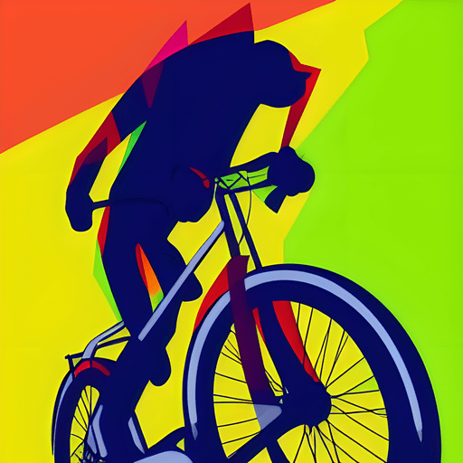
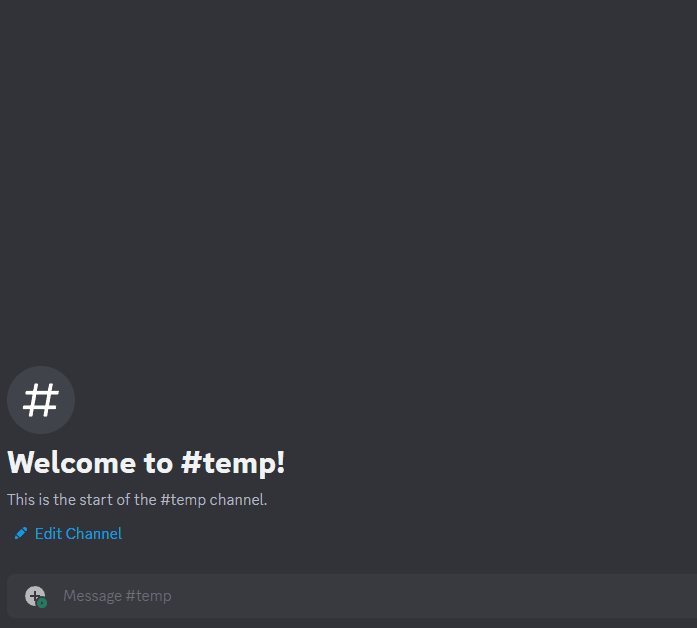
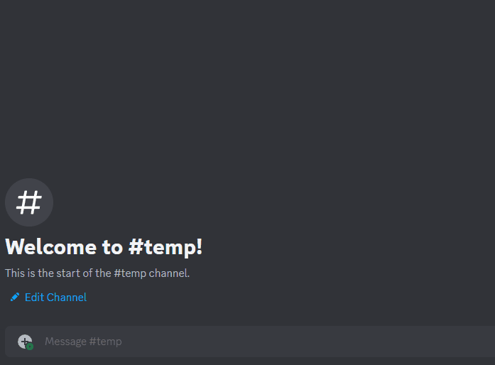

<div align="center">
    <h1>
        
        Cycle Mania Discord Bot
        
    </h1>
    <p>Welcome to the repository.</p>
    <p><em>This custom discord bot (in the form of a discord-strava integration) was built for the members of the <b>Cycle Mania</b> community.</em></p>
    <p><em>It boasts a plethora of useful and fun features, many of which relate to retreiving data from the <b>Strava API</b>, and display it in a prettified format in our Discord server.</em></p>
</div>

## ⚡️ Features

- Dynamic slash commands that can be executed on Discord, for an aesthetic user experience.
- Ability to fetch data from Strava API and visualize it (via a discord embed). Current implemented Strava commands:
  - Club command
  - Leaderboard command
- Cron job that automatically sends new activities from your Strava club to a specified Discord channel (with any interval of time you choose; i.e., 1 hour, 4 hours, 1 day).

## 🚀 Setup

### Fast Deploy

<table border="10px">
  <tr>
    <td align="center">
      <a href="https://railway.app/template/PRJXLo?referralCode=aKyFfd"></a>
      <p>[<em>Ready to go!</em>]</p>
    </td>
    <td align="center">
      <a href="https://heroku.com/deploy"></a>
      <p>[<em>Not yet implemented</em>]</p>
    </td>
  </tr>
</table>

### Prerequisites
> Download & install the following:
1. <a href="https://nodejs.org/en">Node (version 17.9.1 or higher)</a>
2. <a href="https://pnpm.io/installation">pnpm package manager</a>

### Guide

> **Step #1**: Clone repository

```bash
git clone https://github.com/elendil7/Cycle-Mania
```

> **Step #2**: Enter the correct directory
```bash
cd Cycle-Mania
```

> **Step #3**: Install dependencies
```bash
pnpm i
```

> **Step #4**: At project root, create and fill in .env file with ALL Discord & Strava secrets (check .example.env file for info). E.g.;
```ini
DISCORD_BOT_OWNER_ID=000000000000000000
```

> **Step #5**: [Not mandatory] At project root, fill in config.ts with your Discord server & Strava club info, and configure additional options to as per your preference. E.g.;
```json
"clubID": "0000000"
```

> **Step #6**: Build the application
```bash
pnpm run build
```

> **Step #7** Start the application using pm2 manager
```bash
pnpm run pm2:start
```

### Optional
> Stop the bot while its running
```bash
pnpm run pm2:stop
```

> Restart the bot after updating the .env file
```bash
pnpm run pm2:restart
```

> View the log (to check for errors etc)
```bash
pnpm run pm2:log
```

## 🚧 Roadmap

<em>Order: (Newest => Oldest)</em>

- [] [] [] 
- [] [] [] Command that enables / disbales a discord slash command.
- [] [] [] Command that enables / disables cron job, by name.
- [] [] [] Command that you can set reminders with (e.g., remind me to do x in 1 hour).
- [] [] [] Integration to link user's discord account to their Strava account.
  - Command to fetch a user's Strava profile by discord mention / ID.
  - Leaderboard roles (e.g., gold, silver, bronze) based on strava club leaderboard. Must complete {Discord account => Strava account} integration first for this to be possible.
- [] [] [] Command to fetch a specific strava activity by ID.
- [] [] [] Command to fetch a user's Strava profile by name or ID.
  - Include user's statistics (i.e., total distance, total time, etc).
  - Include recent activities (i.e., last 5 activities).
- [] [] [] Auto strava cookie refresh, using browser emulation (puppeteer).
- [x] [07.08.2023] [v1.1.5] Fat whale update
  - Migrated from railway.app to Oracle Cloud VM.
  - Set up a docker container workflow for the project, to run isolated from the host machine.
  - Configured GitHub Actions to automate the build & deployment of the project.
- [x] [04.08.2023] [v1.1.2] Luxury update
  - Implemented command cooldowns (interval may be set in config.ts).
  - Added polymorphism in existing StravaService methods - to accommodate flexibility when executing discord commands. Users can now search for clubs / club leaderboards by both:
    - Club ID
    - Club Name
  - Invoked the use of additional embeds for debugging / critical bug reporting purposes.
- [x] [03.08.2023] [v1.1.1] MongoDB migration update
  - Migrated local storage.json & activities.json to remote mongoDB cluster, to avoid the problem of local .jsons being overwritten on re-building of app (on such services as Heroku / Railway)
  - Beautified the leaderboard, club, and club activity embeds.
  - Other miscellaneous improvements to project structure.
- [x] [01.08.2023] [v1.1.0] Cron job update
  - Added cron jobs for:
    - Auto sending strava club leaderboard embed to specified discord channel on a daily basis.
    - Auto sending new activities (submitted by members of your strava club) to specified discord channel (checks for new activities on an hourly basis).
  - Stopped relying heavily on Strava's API.
- [x] [31.07.2023] [v1.0.7] Leaderboard command complete
  - Polished the field formatting.
  - Added button to switch between Metric <=> Imperial.
  - Suffered an extensive amount.
- [x] [29.07.2023] [v1.0.6] Functionality update
  - Created Strava Leaderboard command!
  - Improved code flow for some services.
  - Installed Undici to bypass CORS, to perform unofficial API HTTP requests.
- [x] [28.07.2023] [v1.0.5] Update the README.md gallery, and add a **Setup Guide**.
- [x] [23.07.2023] [v1.0.5] Complete Strava API implementation - Self Sufficient Token Refresh
  - Polished RefreshToken method which uses a decorator to run checks before each API call.
  - Removed strava-v3 node.js package in favour of raw HTTP requests.
  - Made some miscellaneous quality-of-life changes.
- [x] [18.07.2023] [v1.0.5] Strava API implementation (in progress)
  - Install some dependencies
    - puppeteer
    - ts-node
  - Update tsconfig file
  - Implement singleton software design pattern for StravaService
  - Create first Strava-oriented command!
    - Club (fetches strava club based on ID)
- [x] [17.07.2023] [v1.0.5] First Commands!
  - Help command
  - Reload command
- [x] [17.07.2023] [v1.0.0] Base Project Setup
  - Install initial dependencies
  - Setup boilerplate for services
  - Setup Command & Event initialization methods
  - Configure Command handler for slash commands
  - Add environmental variables

## 💖 Special Thanks

<table>
  <tr>
    <td align="center">
      <a href="https://github.com/pedrofsantoscom/">
        
      </a>
    </td>
    <td>
      <a href="https://github.com/jwren0/">
        
      </a>
    </td>
  </tr>
  <tr>
    <td align="center">
      <a href="https://github.com/pedrofsantoscom/">Pedro Santos</a>
    </td>
    <td align="center">
      <a href="https://github.com/jwren0/">jwren0</a>
    </td>
  </tr>
</table>

## 🖼️ Gallery

### Icons

<table>
  <tr>
    <td width=50% align="center">
      
      <p>Regular Cycle Mania icon</p>
    </td>
    <td width=50% align="center">
      
      <p>"Manic" Cycle Mania icon</p>
    </td>
  </tr>
</table>

### Command showcase

<table>
  <tr>
    <td align="center">
      
      <p>Club command showcase #1</p>
    </td>
    <td align="center">
      
      <p>Club command showcase #2</p>
    </td>
  </tr>
  <tr>
    <td align="center">
      
      <p>Leaderboard command showcase #1</p>
    </td>
    <td align="center">
      
      <p>Leaderboard command showcase #2</p>
    </td>
  </tr>
</table>
